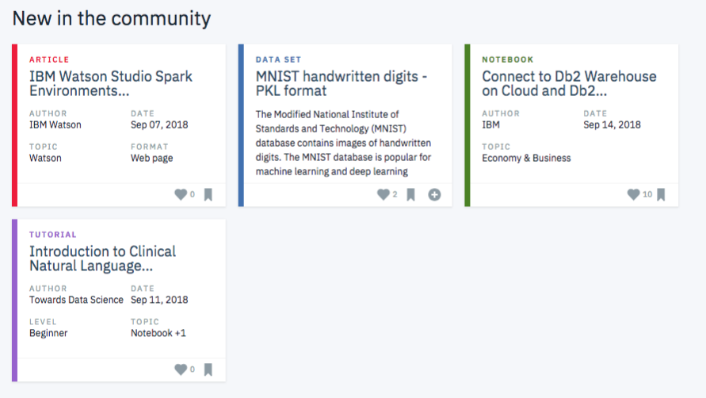

### IBM Watson Article Recommendation Engine
Aim of this recommendation engine is to suggest the next article(s) to users on the IBM Watson platform. 
The notebook analyzes the interactions that users have with articles on the IBM Watson Studio platform, and make recommendations
to them about new articles they will probably lik. Below you can see an example about the dashboard how the 
 articles are displayed on the IBM Watson Platform.

#### Project Motivation
This project is  part of the Udacity Data Scientist Nanodegree and involves Rank based filtering, 
Collaborative filtering, and SVD models for recommendations.

#### The Process
1. Exploratory Data Analysis
2. Rank Based Recommendations
3. User-User Based Collaborative Filtering
4. Matrix Factorization
5. Extras & Concluding

#### Acknowledgement
Thanks to [IBM Watson](https://www.ibm.com/watson) for providing the data.

